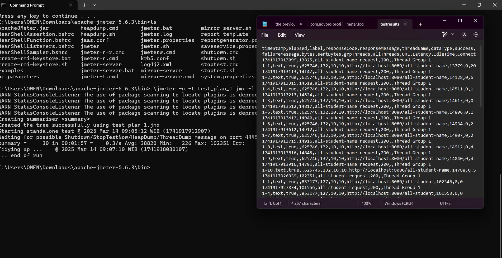
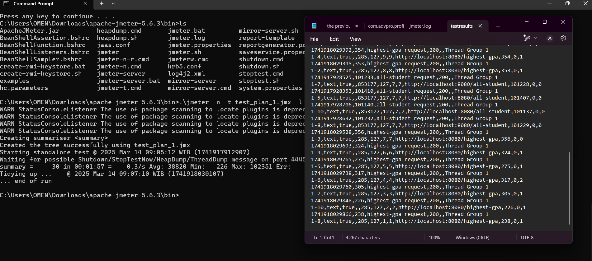
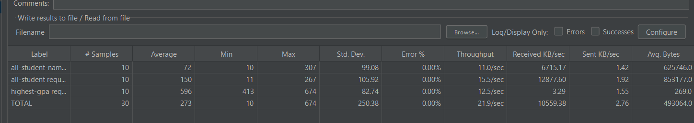

## jmeter for tutorial

## Exercise conclusion
After profiling performance testing with JMeter and IntelliJ Profiler, I have identified the following key points:
| Endpoint            | Before (sec) | After (sec) |
|---------------------|-------------|------------|
| `/all-student`      | 2.5         | 0.150      |
| `/all-student-name` | 1.8         | 0.072      |
| `/highest-gpa`      | 1.6         | 0.596      |

The performance improvement is significant by only eliminating query problems, caching, etc. just these alone have increased the efficiency of the system by about +50% to +90% in terms of response time.

## Reflection
1. What is the difference between the approach of performance testing with JMeter and profiling with IntelliJ Profiler in the context of optimizing application performance? 
JMeter focuses on measuring performance by simulating an or several external users that are interacting with the system. while Intellij profiler works by analyzing the code itself and identifying problems that are visible without the need for external users such as bottlenecking, memory leaks, etc.

2. How does the profiling process help you in identifying and understanding the weak points in your application? 
profiling help me on identifying slow queries, memory leaks, and other problems that are not visible from the outside. i identified the n+1 query problem and the inefficient queries that is plaguing the system.

3. Do you think IntelliJ Profiler is effective in assisting you to analyze and identify bottlenecks in your application code? 
Yes, it has helped me in a way by giving me an actual visualization of the code and the problems that are plaguing the system. although JMeter can also be used to identify bottlenecks, it is not as effective as Intellij profiler in giving a proper visualization of the problem.

4. What are the main challenges you face when conducting performance testing and profiling, and how do you overcome these challenges? 
idenifying proper problems, understanding why the problem is happening, and how to fix it, making sure that i am not being tricked by false positives, and making sure that the changes i make do not affect the functionality of the system. i overcame these problems by taking multiple samples, analyzing the code, and making sure that i focus on optimizing the part of the code that is causing the most problems.

5. What are the main benefits you gain from using IntelliJ Profiler for profiling your application code? 
    - Visual representation of the code
    - Idengifying problems that are not visible from the outside
    - capability to give several metrics that can help me in identifying the problem
    - real time profiling
    - integration with the problem so that i can just click on the problem and it will take me to the code that is causing the problem

6. How do you handle situations where the results from profiling with IntelliJ Profiler are not entirely consistent with findings from performance testing using JMeter? 
i analyze the discrepancy and try to find out whats wrong, then i try taking multiple tests and measure the averages of both. i also take into account that profiler works best in measuring the problem itself while JMeter works best in measuring the system as a whole. then i also focus in the relative improvement of the work that i have done instead of the improvement that has happened
7. What strategies do you implement in optimizing application code after analyzing results from performance testing and profiling? How do you ensure the changes you make do not affect the application's functionality? 
i optimised the queries to reduce database calls, i implemented a caching system on the queries that are being called the most(though this does not work on the first iteration), i replaced some inefficient algorithms such as the string concat one. and to ensure the functionality of the system did not change i applied one optimization at a time and validated the system everytime a change is made, i used the repository classes to isolate database query logic making it easier to optimize without affecting the service, i also maintained the same input output datatypes so that the overall functionality of the system does not change.